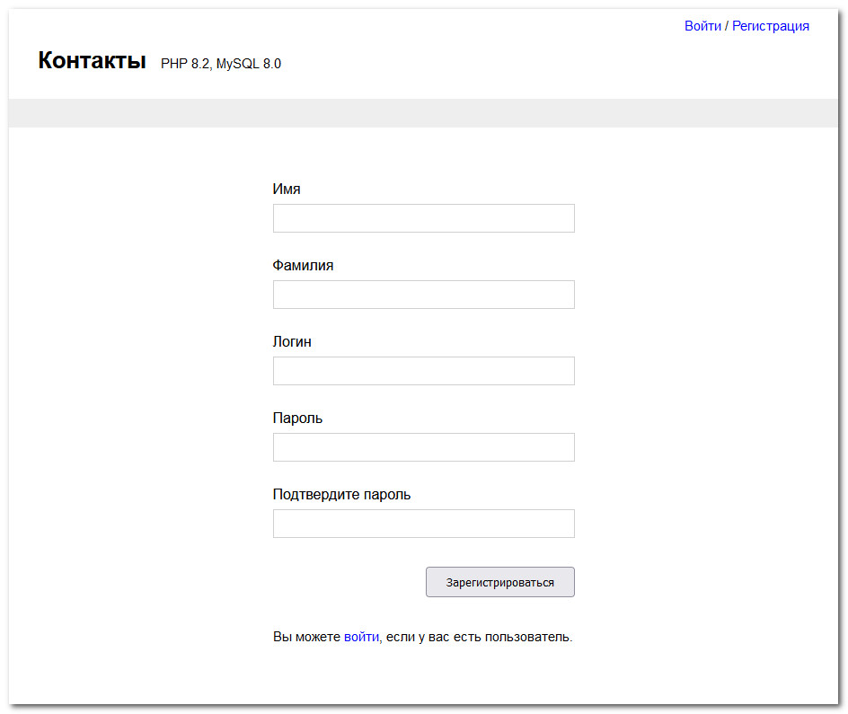
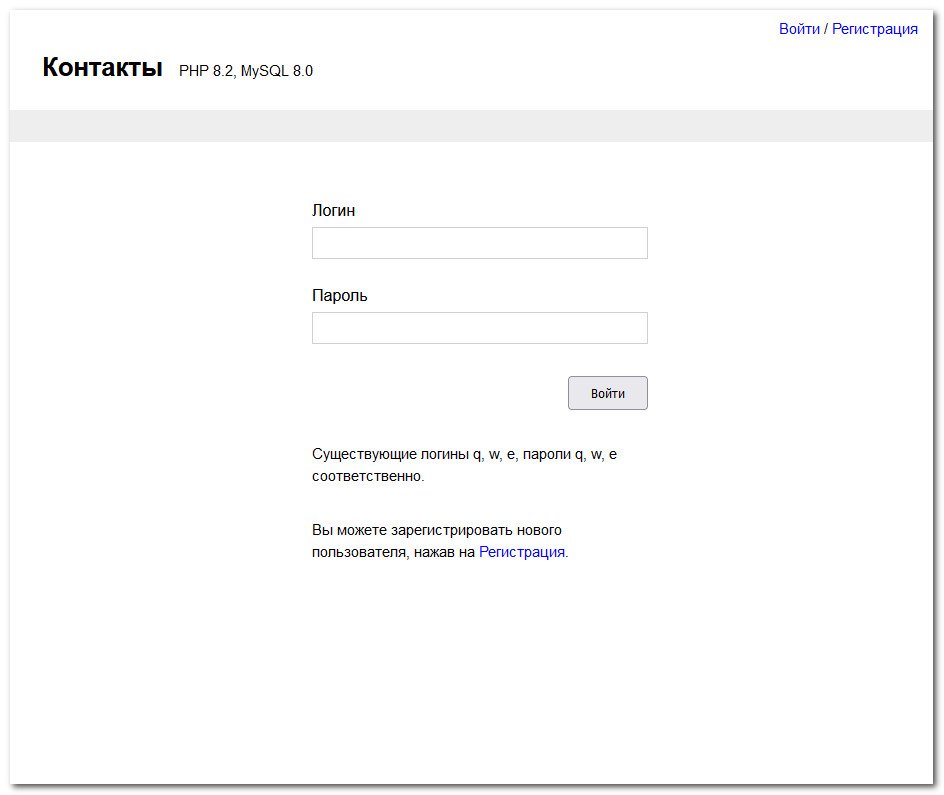

&nbsp;

# Contacts

Технологический стек

* PHP 8.2

* MySQL 8.0

* Javascript >ES6

* CSS, SASS/SCSS

&nbsp;

## 1. Техническое задание (ТЗ)

### 1.1. Работа с пользователем

1. Создание системы регистрации пользователя в проекте (кол-во информации о пользователе не важно)

2. Создание системы авторизации пользователя в проекте

3. Создание закрытой части проекта, доступной только после авторизации

4. Незарегистрированным пользователям доступна только страница регистрации/ авторизации

### 1.2. Создание контактов в системе (общие и личные)

1. Необходимо придумать и разместить на главной странице проекта произвольный «общий список контактов», который будет доступен каждому авторизованному пользователю в системе (достаточно заполнить 10-15 произвольных контактов)

2. Добавить возможность сохранения в личные контакты пользователя контактов из общего списка (раздел избранное)

### 1.3. Результатом выполнения всех частей ТЗ должны стать

1. Система авторизации / регистрации пользователя и страница авторизации (регистрации)

2. Главная страница с общим списком контактов (10-15 контактов) - должна отображаться одинаково для всех авторизованных пользователей

3. Раздел избранных контактов пользователя - должен быть разным для каждого авторизованного пользователя

&nbsp;

## 2. Выполненный проект

### 2.1. Работа с пользователем

1. Создание системы регистрации пользователя в проекте (кол-во информации о пользователе не важно) **-- СДЕЛАНО**

&nbsp;

2. Создание системы авторизации пользователя в проекте **-- СДЕЛАНО**

&nbsp;

3. Создание закрытой части проекта, доступной только после авторизации **-- СДЕЛАНО**

&nbsp;

4. Незарегистрированным пользователям доступна только страница регистрации/ авторизации **-- СДЕЛАНО**

&nbsp;

### 2.2. Создание контактов в системе (общие и личные)

1. Необходимо придумать и разместить на главной странице проекта произвольный «общий список контактов», который будет доступен каждому авторизованному пользователю в системе (достаточно заполнить 10-15 произвольных контактов) **-- СДЕЛАНО**

&nbsp;

2. Добавить возможность сохранения в личные контакты пользователя контактов из общего списка (раздел избранное) **-- СДЕЛАНО**

&nbsp;

### 2.3. Дополнительная информация

1. База данных

    - Сервер БД: MySQL 8.0.33

    - Дамп БД: [contacts.sql](contacts.sql)

    - Данные подключения: [contacts.php](include/contacts.php)

&nbsp;

2. AJAX используется для сохранения выбранных контактов в базе данных

&nbsp;

3. Валидация данных

